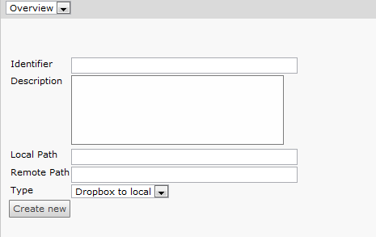

Install DropboxSync
===================

Get an API key
--------------

This extension is not yet approved as an official dropbox applications. That means, you have to register your own dropbox developer API key to use the extension. The registered API key than only works for the dropbox account you registered the API key with and for a maximum of five other accounts.

	1. Go to https://www.dropbox.com/developers and sign in with your dropbox account
	2. Got to My Apps and agree to the Dropbox Developer Terms and Conditions.
	3. Klick on "Create an App" to create a new dropbox application.
		.. image:: Images/AppRegistrationStep1.png
	4. Specify an unique application name and add some text to the description field.
		.. image:: Images/AppRegistrationStep2.png
	5. In the following screen you see the App Key and the App secret you need to configure the extension.
		.. image:: Images/AppRegistrationStep3.png

Configure the Extension
-----------------------

Find the dropbox extension in the extension module and fill in your application Key and the application secret.

Connect to your dropbox
-----------------------

Dropbox authenticates via an OAuth mechanism, which means you do not have to store your dropbox credentials inside the TYPO3 system.

To authenticate the extension with your dropbox, go to the dropbox module and click on ``Connect to Dropbox``. A popup screen appears, where you have to log in to dropnox and authenticate your extension instance.
If everything worked fine, the link in the upper left of the module says ``Disconnect Dropbox``, and does exactly that if you click on it.

Add a sync configuration
------------------------

Now you configure your sync configurations. Click on ``Add Sync Configuration`` to add a new sync configuration.

* Identifier and description is just for you to later identify the right task.
* ``Local path`` specifies a relative path beneath your installations fileadmin folder.
* ``Remote Path`` specifies the remote path beneath dropbox root.
* Select one of the implemented synchronisation types. Currently we only have dropbox to local.

Run a folder sync
-----------------

You can run the sync by clicking on ``Sync all defined folders``. The list than shows detailed run information of the last sync run.

.. image:: Images/SyncConfigList.png

The field Last Sync Info, shows in detail which files are added, replaced, deleted or leaved untouched.

Add a scheduler task
--------------------

Now you can add a scheduler task to sync your folders automatically. Go to the scheduler module and add a new task of type ``Dropbox synchronization``.
